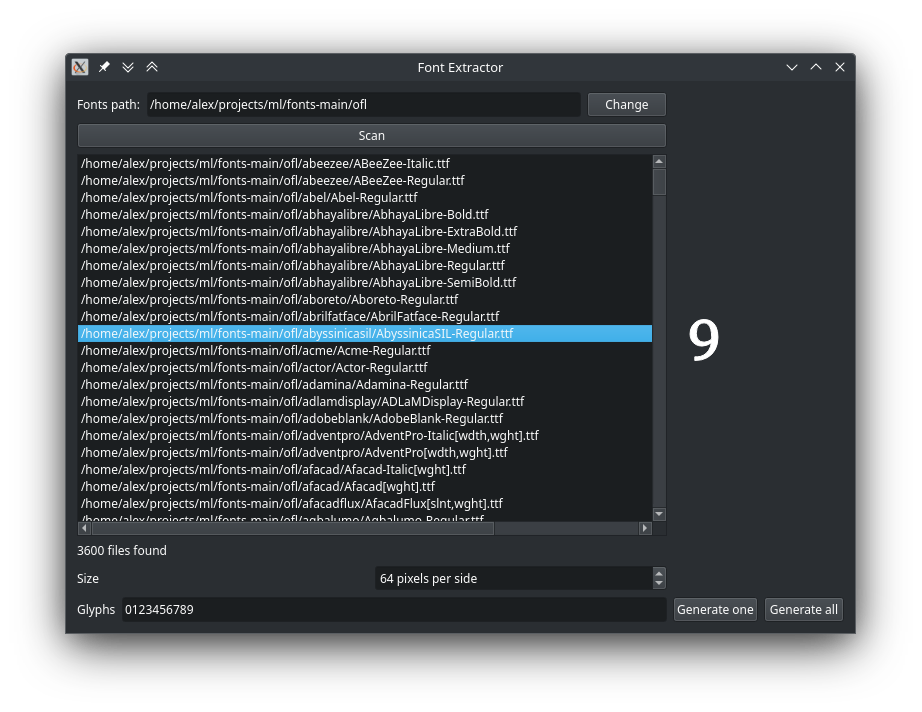

= Font Extractor

This is a simple and very quick-and-dirty app to generate PNG images from fonts.

== Goal

The app was done for the purpose of creating a data set of images containing
just a few glyphs from the files, at a given square resolution.

Those images were used for experimenting at creating
https://en.wikipedia.org/wiki/Generative_adversarial_network[GANs, Generative
Adversarial Networks].

I wanted something similar to the famous
https://en.wikipedia.org/wiki/MNIST_database[MNIST dataset], but with a bit of a
different flavor, and with the possibility to easily work with the same dataset
but with more pixels.

Given that the goal was machine learning and not {cpp}/Qt development, all while
being in a hurry, the app is quite simple, and the code is rough. If you are a
machine learning student, feel free to ask for ask for improvements in the issue
tracker, as it should be quite easy to do.

== Requirements

The application uses the Qt framework for its UI, and for reading the font files
and generating the desired PNG ones. Get it from a package manager to build from
source (APT, RPM, Homebrew, Scoop, Chocolatey, etc), or alternatively, get Qt
from https://www.qt.io[qt.io], and ignore any hints at a paid license (use the
Open Source one).

You'll require a lot of font files in order to have a decent dataset. I've just
downloaded the Google Fonts repository, which, at the time of writing this,
contained over three thousand files of suitable licenses like OFL. Not as many
as the MNIST dataset, but good enough.

== License

This app is licensed under the GNU GPL v3 license.
